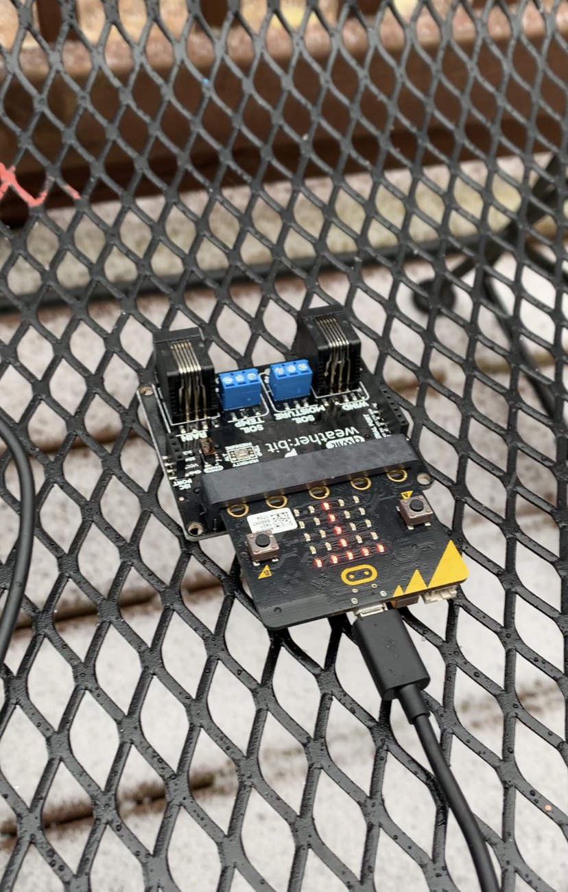
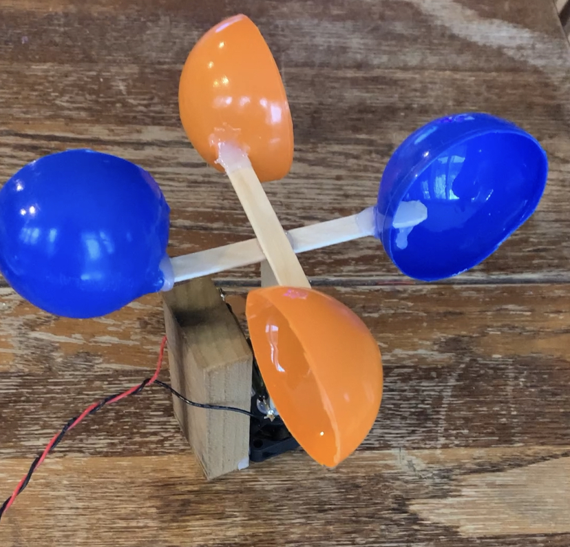

# Weather Station
### ETR 107 Final Project
#### Weatherbit for Microbit with Tkinter

This is a project that I thouroghly enjoyed.  I wanted to create a interface from my computer using tkinter and allow communication to the weather:bit extension on my microbit.
The measurements I am taking is for Windspeed, Temperature, Barometric Pressure, Humidity, Sunlight Level, and altitude.  
 


The following code is the Python tkinter buttons that will call specifc sensors from the weather:bit and output the readings. 


   ```# Python serial interface to a micro:bit
   
   import serial
   import tkinter as tk

   # Send a command to the micro:bit and show the response
   def myfunc(action):
   print ("Requested action: ",action)
   out = action + "\n"
   out2 = out.encode('utf_8')
   ser.write(out2)   
   lstatus.config(text = ser.readline())

   # configure the serial connections
   ser = serial.Serial(
    port='COM11',
    baudrate=115200
   )

   root = tk.Tk()
   root.title("Weather Station")

   # Button for temperature 
   bt_T = tk.Button(root, width=25,text= "Temperature",bg='silver' ,
   command = lambda: myfunc("T"),relief="raised")
   bt_T.grid(row = 1,column = 1)

   # Button for light sensor 
   bt_L = tk.Button(root, width=25,text= "Light Level",bg='silver' ,
   command = lambda: myfunc("L"),relief="raised")
   bt_L.grid(row = 1,column = 2)

   # Button for humidity
   bt_1 = tk.Button(root, width=25,text= "Humidity",bg='silver' ,
   command = lambda: myfunc("H"),relief="raised")
   bt_1.grid(row = 2,column = 1)

   # Button for Barometric Pressure
   bt_0 = tk.Button(root, width=25,text= "Barometric Pressure",bg='silver' ,
   command = lambda: myfunc("P"),relief="raised")
   bt_0.grid(row = 2,column = 2)

   # Button for Wind Speed
   bt_0 = tk.Button(root, width =25, text= "Wind Speed",bg='silver' ,
   command = lambda: myfunc("W"),relief="raised")
   bt_0.grid(row = 3,column = 1)

   # Button for Altitude
   bt_0 = tk.Button(root, width =25, text= "Altitude",bg='silver' ,
   command = lambda: myfunc("A"),relief="raised")
   bt_0.grid(row = 3,column = 2)


   # Label to show results
   lstatus = tk.Label(root, width= 50, text= "                 ", relief="raised")
   lstatus.grid(row = 4,column = 1,  columnspan = 2)

   root.mainloop()
   ```
   
In order to call specifc sensors, I created a command and a math equation to convert them to metric and standard outputs depending on the sensor.  To start the weather bit monitoring you need to use the command weatherbit.start_weather_monitoring().  The following is my Python code for the serial interface to the microbit/weatherbit extension.  
   
   ```def on_data_received():
    global cmd
    cmd = serial.read_line()
    cmd = cmd.substr(0, 1)
    basic.show_string(cmd)
    if cmd == "T":
        serial.write_line("Temperature: " + str(Math.idiv(weatherbit.temperature(), 100)))
    elif cmd == "L":
        serial.write_line("Light: " + ("" + str(input.light_level())))
    elif cmd == "H":
        serial.write_line(" Humidity : " + str(Math.idiv(weatherbit.humidity(), 1024)))
    elif cmd == "P":
        serial.write_line("Presure hPa: " + str(Math.idiv(weatherbit.pressure(), 25600)))
    elif cmd == "W":
        serial.write_line("Wind Speed: " + str(weatherbit.wind_speed()))
    elif cmd == "A":
        serial.write_line("Altitude: " + str(weatherbit.altitude()))
    else:
        serial.write_line("cmd: " + cmd)
serial.on_data_received(serial.delimiters(Delimiters.NEW_LINE), on_data_received)

cmd = ""
weatherbit.start_weather_monitoring()
weatherbit.start_wind_monitoring()```
```
I created an anomometer to plug into my weather:bit by using a fan for the base that rotated very smoothly.  Originally I attempted to have the weather:bit read the output voltage of the fan and calculate windspeed but the weather:bit needed a tachometer reading in order to calculate windspeed.  You can see in the pictures I used a reid switch and a magnet to make a tachometer from the rotations of the anomometer.   Here are a few photos of my anemometer working from my weather:bit



